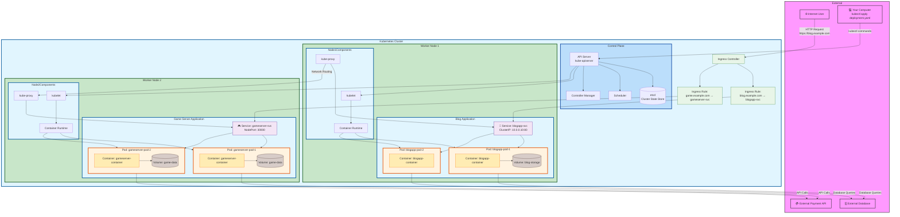

# Kubernetes-Diagrams

```mermaid
graph TB
    %% External Environment
    subgraph External
        InternetUser[🌐 Internet User]
        YourComputer[💻 Your Computer<br/>kubectl apply deployment.yaml]
        ExternalDB[🗄️ External Database]
        PaymentAPI[💳 External Payment API]
    end

    %% Kubernetes Cluster Box
    subgraph Cluster [Kubernetes Cluster]
        %% Control Plane
        subgraph ControlPlane [Control Plane]
            APIServer[API Server<br/>kube-apiserver]
            etcd[(etcd<br/>Cluster State Store)]
            Scheduler[Scheduler]
            ControllerMgr[Controller Manager]
        end

        %% Ingress
        Ingress[Ingress Controller]

        %% Worker Node 1
        subgraph WorkerNode1 [Worker Node 1]
            subgraph Node1Components
                Kubelet1[kubelet]
                KubeProxy1[kube-proxy]
                ContainerRuntime1[Container Runtime]
            end

            %% Blog Application on Node 1
            subgraph BlogApp [Blog Application]
                BlogService[📡 Service: blogapp-svc<br/>ClusterIP: 10.0.0.10:80]

                subgraph BlogPod1 [Pod: blogapp-pod-1]
                    BlogContainer1[Container: blogapp-container]
                    BlogVolume1[(Volume: blog-storage)]
                end

                subgraph BlogPod2 [Pod: blogapp-pod-2]
                    BlogContainer2[Container: blogapp-container]
                end
            end
        end

        %% Worker Node 2
        subgraph WorkerNode2 [Worker Node 2]
            subgraph Node2Components
                Kubelet2[kubelet]
                KubeProxy2[kube-proxy]
                ContainerRuntime2[Container Runtime]
            end

            %% Game Server Application on Node 2
            subgraph GameServerApp [Game Server Application]
                GameService[🎮 Service: gameserver-svc<br/>NodePort: 30000]

                subgraph GamePod1 [Pod: gameserver-pod-1]
                    GameContainer1[Container: gameserver-container]
                    GameVolume1[(Volume: game-data)]
                end

                subgraph GamePod2 [Pod: gameserver-pod-2]
                    GameContainer2[Container: gameserver-container]
                    GameVolume2[(Volume: game-data)]
                end
            end
        end

        %% Ingress Rules
        IngressRule1[Ingress Rule:<br/>blog.example.com → blogapp-svc]
        IngressRule2[Ingress Rule:<br/>game.example.com → gameserver-svc]
    end

    %% Connections and Data Flow
    %% External to Cluster
    InternetUser -->|HTTP Request<br/>https://blog.example.com| Ingress
    YourComputer -->|kubectl commands| APIServer

    %% Control Plane Communications
    APIServer --> etcd
    APIServer --> Scheduler
    APIServer --> ControllerMgr
    APIServer --> Kubelet1
    APIServer --> Kubelet2

    %% Ingress Flow
    Ingress --> IngressRule1
    Ingress --> IngressRule2
    IngressRule1 --> BlogService
    IngressRule2 --> GameService

    %% Service to Pod Connections
    BlogService --> BlogPod1
    BlogService --> BlogPod2
    GameService --> GamePod1
    GameService --> GamePod2

    %% Node Components
    Kubelet1 --> ContainerRuntime1
    Kubelet2 --> ContainerRuntime2
    ContainerRuntime1 --> BlogPod1
    ContainerRuntime1 --> BlogPod2
    ContainerRuntime2 --> GamePod1
    ContainerRuntime2 --> GamePod2

    %% Pod to External Services
    BlogPod1 -->|Database Queries| ExternalDB
    GamePod1 -->|API Calls| PaymentAPI
    BlogPod2 -->|Database Queries| ExternalDB
    GamePod2 -->|API Calls| PaymentAPI

    %% Internal Pod Communications
    KubeProxy1 --> BlogService
    KubeProxy2 --> GameService
    KubeProxy1 -->|Network Routing| KubeProxy2

    %% Volume Mounts
    BlogContainer1 --> BlogVolume1
    GameContainer1 --> GameVolume1
    GameContainer2 --> GameVolume2

    %% Styling
    classDef external fill:#f9f,stroke:#333,stroke-width:2px
    classDef cluster fill:#e1f5fe,stroke:#01579b,stroke-width:3px
    classDef control fill:#bbdefb,stroke:#0d47a1
    classDef worker fill:#c8e6c9,stroke:#1b5e20
    classDef service fill:#f3e5f5,stroke:#4a148c
    classDef pod fill:#fff3e0,stroke:#e65100
    classDef container fill:#ffecb3,stroke:#ff6f00
    classDef volume fill:#d7ccc8,stroke:#4e342e
    classDef ingress fill:#e8f5e8,stroke:#2e7d32

    %% Apply Styles
    class External,YourComputer,InternetUser,ExternalDB,PaymentAPI external
    class Cluster cluster
    class ControlPlane control
    class WorkerNode1,WorkerNode2 worker
    class BlogService,GameService service
    class BlogPod1,BlogPod2,GamePod1,GamePod2 pod
    class BlogContainer1,BlogContainer2,GameContainer1,GameContainer2 container
    class BlogVolume1,GameVolume1,GameVolume2 volume
    class Ingress,IngressRule1,IngressRule2 ingress
```
